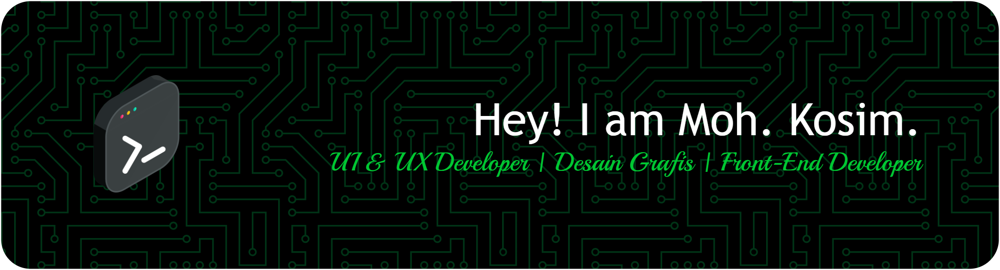

<!-- ## Hi! 👋 I'm Kosim. -->

A website designer with a deep interest in creating engaging and functional interfaces. I have a passion for UI/UX and always strive to deliver an optimal user experience in every project I work on.
I actively develop various projects, including using Laravel and Tailwind CSS, to build responsive and aesthetic interfaces.

- 🔭 I’m currently working on @dicodingacademy
- 🌱 I'm currently learning about Frond-and Developer and UI/UX Designer
- 💬 Ask me about website design
- ⚡ Fun fact: beginner
- 📫 How to reach me : mohkosim8014@gmail.com
- 📂 Link Portofolio: [https://mohkosim.github.io/portofolio/](https://mohkosim.github.io/portofolio/)

## Tech Stack

  
  
  
  
  
  
  
  
  
  
  
  

 

## Design Tools

   

## Development Machine

   

## 🛠️ Skills & Technologies

### Front-End

✅ **Figma** → UI/UX design tool    
✅ **HTML** → Basic structure of web pages    
✅ **CSS** → Styling for web pages    
✅ **JavaScript** → Programming language for interactivity    
✅ **Bootstrap** → CSS framework for responsive design    
✅ **Tailwind CSS** → Utility-first CSS framework    
✅ **Flowbite** → UI components based on Tailwind CSS  

## Github Statistic

<h2 align="left">Play games with me</h2>

###

<picture>
  <source media="(prefers-color-scheme: dark)" srcset="https://raw.githubusercontent.com/Mohkosim/Mohkosim/output/pacman-contribution-graph-dark.svg">
  <source media="(prefers-color-scheme: light)" srcset="https://raw.githubusercontent.com/Mohkosim/Mohkosim/output/pacman-contribution-graph.svg">
  
</picture>

###

###

## Follow me

